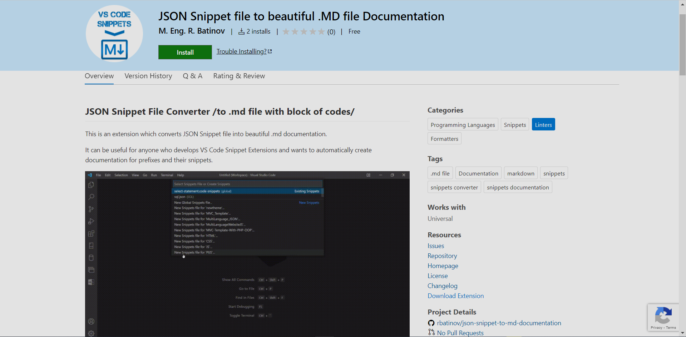
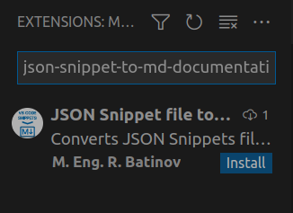
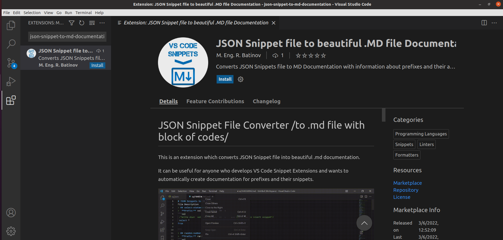

# JSON Snippet File Converter /to .md file with block of codes/

This is a VS Code extension which converts JSON Snippet file into beautiful .md documentation.  

It can be useful for anyone who develops VS Code Snippet Extensions and wants to automatically create documentation for prefixes and their snippets.


## Features

- Converts snippet JSON file into .md file.
- Visualizes block of prefixes with the specified code.
- Comments can be used in JSON file - the extension skips them when converting.
- Use description property to set the snippet information (header in .md file).
- Multiple prefixes are allowed - it will show them as `prefix 1 OR prefix 2 or prefix N`.
- The body property is get to visualize the block of code.

## Requirements

- You need to have VS Code Installed, and of course this extension.
- For correct vizualization of your code, the file name should contain the language -> `languageName.json`

> For example `sql.json` will result in:  

```sql
SELECT *   
FROM table;
```  
  
> `html.json` will result in:

```html
<div>
    <p>Hello World</p>
</div>
```  


## How to use

1. Install the extension: 
    - from [Marketplace](https://marketplace.visualstudio.com/items?itemName=MEngRBatinov.json-snippet-to-md-documentation&ssr=false#overview).  
      
    - from VS Code
        1. Open VS Code.
        2. Select `Extensions` from left panel or press `Ctrl + Shift + X`.
        3. Type in `json-snippet-to-md-documentation`. The extension with name `JSON Snippets file to beautiful .MD file Documentation` will show.   
          
        4. You can select the extension and read the overview features if you want.  
          
        5. Pres `Install` button and you are ready.

2. Open your snippet.json file.  
3. Press Ctrl + Shift + P and write down:

* `export to .md file documentation`  
Choose the command and new .md file with content will be opened.

4. If you want to change the default settings you can:  
    1. Go to `VS Code Settings`
        - File > Preferences > Settings
    2. Select `User Tab`
    3. Collapse `Extensions Section` 
    4. Choose `JSON Snippets Configurations`
    5. List of options will be loaded /in *italics* are the default values which can be changed/:
        - `Multiple Prefixes Delimiter`
            - If some snippet has multiple prefixes, this is the delimiter for them in the documentation.
                > ## select-statement
                >  **Prefix:** sel OR select
                
                > ### Multiple Prefixes Delimiter
                >
                >   Delimiter for multiple Prefixes
                >
                >   *OR*       
        - `Code Block Comment Message /before Prefixes/`
            - This is the first comment line of the block code which shows the prefixes. As prefixes are dynamically generated you should insert your desired text BEFORE them.
                ```sql
                 /*Write down sel OR select OR s and press Tab to insert snippet*/ 
                ```
                > ### Code Block Message Start 
                >
                >   Code Block Comment Message /before Prefixes/
                >
                >   *Write down*       
        - `Code Block Comment Message /after Prefixes/`
            - This is the first comment line of the block code which shows the prefixes. As prefixes are dynamically generated you should insert your desired text AFTER them.
                ```sql
                 /*Write down sel OR select OR s and press Tab to insert snippet*/ 
                ```
                > ### Code Block Message End 
                >
                >   Code Block Comment Message /after Prefixes/
                >
                >   *and press Tab to insert snippet*

        - `File Header Name with H1 heading`
            - This is the H1 heading text of the newly generated .md file.
                # JSON Snippets to MD File

                > ### MDHeader 
                >   
                >   File Header Name with H1 heading
                >
                >   *JSON Snippets to MD File*

        - `File Description`
            - This is the description of the .md file.
                # JSON Snippets to MD File
                This is a simple documentation of prefixes with their associated snippets.

                > ### MDdescription
                >
                >   File Description
                >
                >   *This is a simple documentation of prefixes with their associated snippets.*


## Known Issues

Currently there are no known issues.

## Release Notes

### 0.3.0

Change extension logo

### 0.0.1

First release of extension
    
## License

[MIT](LICENSE.txt)

**Enjoy!**,  
**[M. Eng. R. Batinov](https://radoslav-batinov.bss.design/)**
